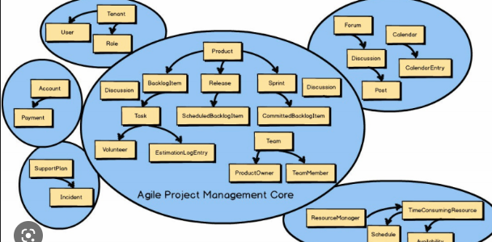

### 일관성 없는 모델

‘리드’라는 용어가 서로 다르게 사용된다.

- 마케팅 부서 - 제품에 대한 관심
- 영업 부서 - 영업 프로세스의 전체 생명 주기?

모호성은 의사소통에서는 얘기를 하면서 추론할 수 있어 문제가 되지 않는다.

⇒ 소프트웨어로 표현할 때 문제가 된다.

**해결방법**

- 모든 종류의 문제에 사용할 수 있는 단일 모델을 설계하는 것
    - 모든 것에 적합해야하지만 결국 복잡성에 직면하게 됨
- 용어 앞에 접두사 추가
    - 인지부하
    - 유비쿼터스 언어와 일치하지 않음 → 얘기를 할 떄 접두사 없이 해도 소통 가능하니까.

### **즉 일관성 있게 얘기를 해야한다.**

**바운디드 컨텍스트**

- 유비쿼터스 언어를 여러 개의 작은 언어로 나눠서 할당
  

- 컨텍스트를 명시적이고 중요한 비즈니스 도메인의 요소로 모델링할 수 있다.

**모델 경계**

모델의 경계를 정의하는 것은 모델링 프로세스의 본질적인 부분

- 지도 - 특정 목적 범위 내에서만 유용하고 일관성이 있다.
- 바운디드 컨텍스트 - 일관성이 유지되는 경계

**바운디드 컨텍스트의 범위**

- 도메인을 모델링하기 위해 우리는 모델을 분할하고, 세분화된 모델에 적용 가능한 컨텍스트를 엄격히 정의해야함
- 모델 자체로 유용해야하기 때문에 크기에 대한 결정은 도메인에 따라 결정된다.
  - 날방 - 시스템 백오피스, 가맹점 백오피스, 유저 프론트 부분도 경계를 나눈것이 아닐까??

### 바운디드 컨텍스트 대 하위 도메인

**하위 도메인과 바운디드 컨텍스트 사이의 상호작용**

하위 도메인은 비즈니스 전략

바운디드 컨텍스트는 소프트웨어 설계

- 단일 모델
- 모델이 크고 유지보수하기 어려운 경우 분할 모델

**경계**

무엇이 들어있는지, 밖으로 나가는지, 범위, 그 무엇이 이동하는지?

바운디드 컨텍스트 패턴은 물리적 경계와 소유권 경계를 규정하기 위한 도메인 주도 설계 도구

**물리적 경계**

바운디드 컨텍스트는 개별 서비스 / 프로젝트로 구현돼야한다.

구현, 진화, 버전 관리를 각각의 다른 바운디드 컨텍스트와 독립적으로 해야함

- 네임스페이스, 모듈, 패키지

**소유권 경계**

바운디드 컨텍스트는 한 팀에서만 구현 발전 유지 관리를 해야함

### 결론

내재된 충돌을 발견할 때마다 유비쿼터스 언어를 여러 개 바운디드 컨텍스트로 분해해야한다.

그리고 바운디드 컨텍스트 안에서는 일관성 있어야한다.

⇒ 설계를 어떻게 하냐에 따라서 달라진다.

⇒ 서로 다른 바운디드 컨텍스트는 독립적이다.

회사 - 시스템 백오피스, 가맹점 백오피스, 유저 프론트 부분도 경계를 나눈것이 아닐까??