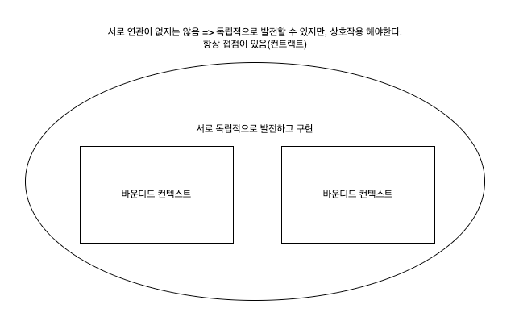
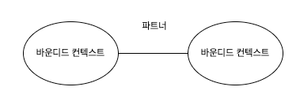
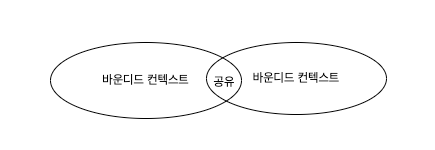
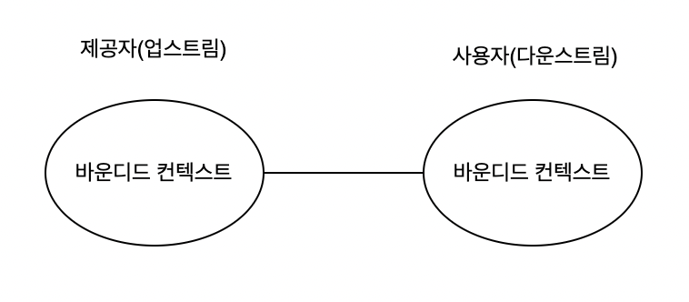
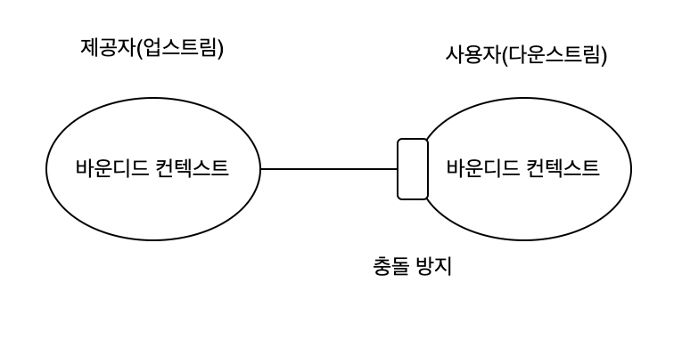
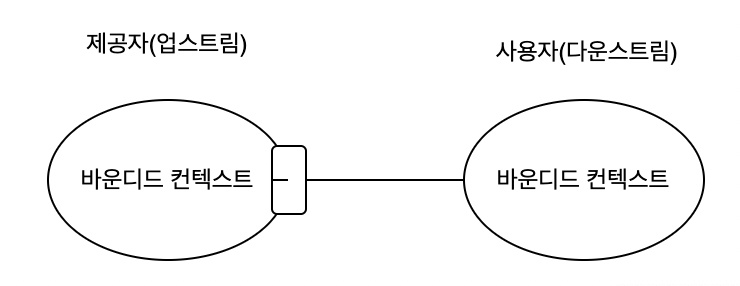

### 협력형 패턴 그룹

**파트너십 패턴**

- 연동을 하면서 조절 및 협력
- 커뮤니케이션이 어렵다면 적합하지 않을 수도 있다. ⇒ 지리적으로 멀다.

**공유 패턴 커널**

- 서로 다른 바운디드 컨텍스트에 즉시 영향
- 변경되면 즉시 반영되어야함 ⇒ 프로젝트에 common(공통) 부분
    - 전파하지 않으면 모델의 일관성이 깨지므로 조심
- 공유 커널 사용 이유
    - 하지만 공유 커널은 중복 비용과 조율 비용을 보고 사용할지 말지 판단해야한다.
    - 바운디드 컨택스트에 위반

### 사용자 - 제공자 패턴 그룹

**순응주의자 패턴**

- 힘의 균형이 제공자에게 있는 경우
- 조직 외부의 서비스 제공자와 연동하는 경우
    - 외부 API 사용(브로드밴드, 메이크샵?)

**충돌 방지 계층 패턴**

- 제공자의 모델을 따르는 것을 원치 않을 경우
    - 다운스트림의 바운디드 컨텍스트가 하위 도메인을 포함할 경우
    - 업스트림 모델이 사용자의 요건에 비효율적
    - 업스트림이 컨트랙트를 자주 변경하는 경우

**오픈 호스트 서비스 패턴**

- 연동 지향 언어
- 업스트림은 사용자를 보호하고 최고의 기능 제공 - 프레임 워크?, 프로토콜?, 오픈 API?

**분리형 노선**

- 업스트림, 다운스트림이 서로 협력하지 않는 것
    - 커뮤니케이션 이슈
    - 일반 하위 도메인
    - 모델의 차이

**컨텍스트 맵**

- 시스템의 바운디드 컨텍스트와의 연동을 시각적으로 표현
- 지금 서비스를 표현해보기

**한계**

- 컨텍스트 맵을 작성하는 것은 어려운 작업이다.
- 여러 하위 도메인에 걸친 시스템의 바운디드 컨텍스트에는 여러 패턴이 있을 수 있다. (충돌방지 패턴 + 협력 패턴 등등

### 결론

바운디드 컨텍스트끼리는 독립적이지 않고 상호작용을 해야한다.

연습문제
1. A
2. B
3. A
4. B