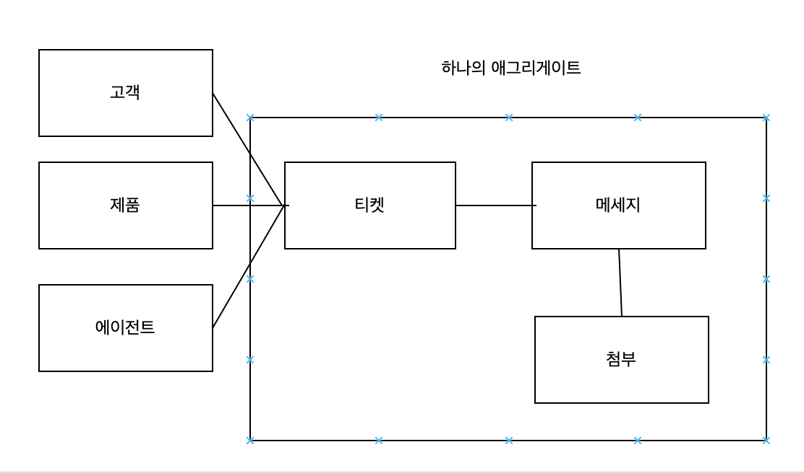
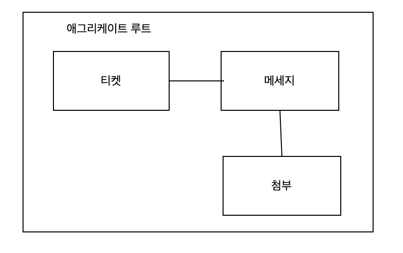

> 전술적 도메인 주도 설게 - 애그리게이트, 밸류 오브젝트, 레포지토리 등 도메인 모델 패턴을 구현하는 데 효과적인 도구의 집합
>

### 도메인 모델

- 비즈니스 로직을 다루기.
    - CRUD 인터페이스 대신 복잡한 상태 전환, 비즈니스 규칙과 불변성 등을 다룬다.
- 본질적으로 복잡 - 복잡성을 추가하면 안됨
    - DB, 외부 시스템 호출 구현, 인프라 또는 기술적인 관심사를 피해야한다.
    - => 플레인 올드 오브젝트

### 밸류 오브젝트(VO)

**정의**

- 값을 가지고 있는 객체, 복합적인(composition) 값에 의해 식별되는 객체
    - Color - 색을 식별하기 위한 명시적인 식별 필드가 필요 없음

**VO의 구현**

- String, integer 등 원시 데이터 타입에 전적으로 의존해서 표시하는 것은 위험하다.
    - Class Account { private String password }
    - 결국에는 validation 체크를 해야한다.
    - 유효성 검사 로직이 중복되기 쉽다.
- VO를 사용해서 코드 작성
    - Class Account { private Password password} - 내부에 비밀번호 조건이 들어있음
    - 명료성 향상
    - 유효성 검사 로직이 VO자체에 있다.
- 다른 예시로는 Height - 특정 도량형에 종속되지 않는다.
- Money - 원, 달러에 종속되지 않는다.
- 좀더 직관적이고 실수가 적은 객체 모델을 사용할 수 있다.
- VO는 불변의 객체로 구현되므로 필드가 바뀌면 다른 객체가 생성됨
    - 동일성 검사(equals) 함수를 오버라이드해서 적절히 구현하는 것이 중요

**밸류 오브젝트를 사용하는 경우**

- 코드의 표현력, 안정성 향상 => 부작용, 동시성 문제가 없다.
- 다른 객체의 속성을 표현하는 도메인 요소에 사용 (Password)

### 엔티티

**정의**

- 다른 엔티티 인스턴스와 구별하기 위해 명시적인 식별 필드가 필요하다. => ORM에서 엔티티라고 표현하는 이유가 아닐까?
- Class Person { private String name }
    - 같은 이름을 가진 사람이 있을 수 있다.
    - 사람을 식별하기 위한 personId 가 필요하다.
- 앤티티의 식별 필드는 인스턴스마다 고유해야한다.
- 앤티티는 불변이 아니라 변할 것으로 생각된다.
- 대신 엔티티의 식별 필드는 불변이여야 한다.

### 애그리게이트

**정의**

- 애그리게이트는 엔티티다.
    - 식별 필드가 필요하고 인스턴스의 생애주기 동안 상태가 변할 것으로 예상된다.
- 앤티티 그 이상이다.
    - 데이터 일관성 보호

**일관성 강화**

- 변경 요청을 검사해서 비즈니스 규칙에 위배되지 않게 해야한다.
    - 비즈니스 로직을 통해서만 애그리게이트의 상태를 변경하게 해야한다.
    - 메서드를 실행해야만 상태를 변형
    - => 커맨드
    - 약간 JPA에 편의 메서드 or Setter 사용하지 않고 메서드 사용하는 예시가 되지 않을까 싶다.
- 동시성 점검
    - 트랜잭션이 커밋한 변경을 나중의 트랜잭션이 은연중에 덮어쓰지 않게 해야한다.

**트랜잭션 경계**

- 자신의 비즈니스 로직을 통해서만 수정될 수 있기 때문에 트랜잭션의 경계 역할을 한다.
    - 상태가 수정되면 모든 변경이 커밋되거나 롤백되어야 한다.
- 애그리게이트의 경계가 비즈니스 도메인의 불변성과 규칙을 따르도록 신중히 설계되어야한다.

**다른 애그리게이트 참조하기**

- 애그리게이트 내의 모든 객체는 같은 트랜잭션 경계를 공유하기 때문에 커지면 성능과 확장에 문제가 생긴다.
- 비즈니스 로직에 따라 강력한 일관성이 필요한 정보만 애그리게이트에 포함돼야한다.
- 외부 애그리게이트를 참조할 때 ID를 이용하는 이유는 경계에 속하지 않음을 명확히 하고 트랜잭션 경계를 갖게 보장하기 위함이다.
    - 이부분이 JPA에서 연관관계의 경계를 말하는 것 같다.
    - Class Ticket { Message customerId, productId, agentId }

    ```java
    class Ticket {
    	@ManyToOne
    	private Message message;
    	
    	private Long customerId;
    	private Long productId;
    	private Long agentId;
    }
    ```

  

- 애그리게이트에 속하는지 판단하는 방법
    - 일관된 데이터를 다루는 상황에서 시스템의 상태를 손상시킬 수 있는지 여부 판단
    - 그 비즈니스 로직이 애그리세이트에 있는지 여부 판단

**애그리게이트 루트**

- 커맨드 중 하나를 실행해서만 수정 가능하다.



- 엔티티 계층 구조를 대표하기 때문에 루트로 지정되어야 한다.
    - 이것이 JPA 강의에서 연관관계 주인(?)부분이 아닐까 싶다.
    - 그리고 커멘드가 편의 메서드가 되는듯하다.
- 애그리게이트 루트를 통해서만 수정 가능하다.

### 도메인 이벤트

- 외부에서 애그리게이트와 커뮤니케이션 할 수 있는 다른 메커니즘
- 비즈니스 도메인에서 일어나는 중요한 이벤트를 설명하는 메세지
    - 자신의 도메인, 다른 프로세스, 외부 시스템 - MSA일때 이런방식으로 하지 않을까?

### 도메인 서비스

- 비즈니스 로직을 구현한 상태가 없는 객체다.(stateless object)
- 티켓 애그리게이트 예제
    - 제한된 시간 내에 고객에게 솔루션 제시
    - 시간은 다양한 출처에서 정보를 필요로 하는 경우에 도메인 서비스 구현한다.
    - => 여러 애그리게이트의 데이터를 읽는 것을 도와줌

**복잡성 관리**

- 시스템 자유도
    - 시스템 상태를 설명하는데 필요한 데이터 요소의 개수로 측정

```java
class A {
	private int a;
	private int b;
	private int c;
	private int d;
	private int e;
}

class B {
	private int _a;
	private int _b;

	public int A {... B, C 사용}
	public int B {}
	public int C {}
	public int D { E 사용}
	public int E
}
```

- classA 상태 설명하는데 얼마나 많은 데이터 요소가 필요한가 -> 5
- classB 상태 설명하는데 얼마나 많은 데이터 요소가 필요한가 -> 2 (A, D) 의 값만 계산하면 나머지 변수는 추론 가능
- classA가 classB보다 더 간단해보이지만 실제로는 복잡하다
    - 이것이 애그리게이트와 밸류 오브젝트를 사용하는 이유이다.

### 결론

도메인 모델을 어떻게 설게하냐에 따라 복잡도가 많이 차이나는것 같다.

### 연습문제
1. C
2. D
3. B
4. D
5. D