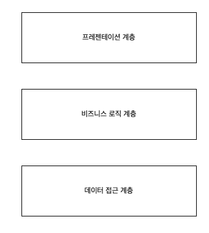
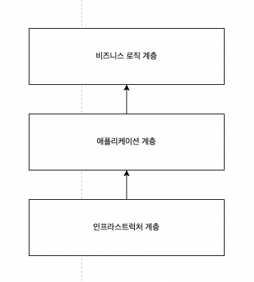
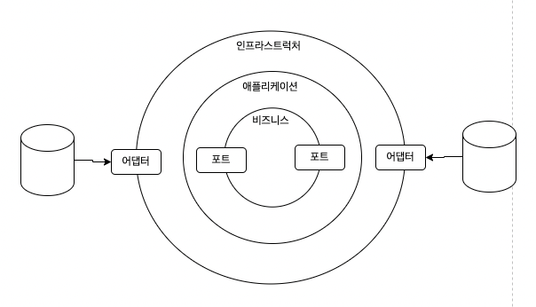
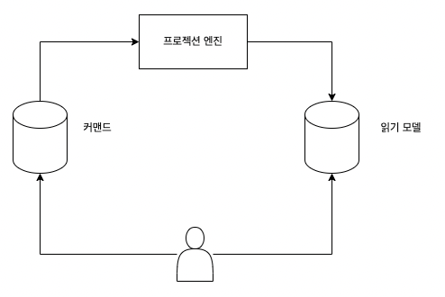

### 비즈니스 로직과 아키택처 패턴

> 비즈니스 로직 구현을 지원하고 유지보수에 중요
⇒ 계층형 아키텍처, 포트와 어댑터, CQRS
>

### 계층형 아키텍처

**프레젠테이션 계층(사용자 인터페이스 계층)**

- 상호작용을 하기 위한 사용자 인터페이스
    - GUI, CLI, REST API
- 외부 환경으로부터 요청을 받고 결과를 소통하기 위한 수단

**서비스 계층(어플리케이션 계층)**

- 프레젠테이션과 비즈니스 로직 계층 중간 역할
- 하부 계층을 조율하는 데 필요한 것들을 감싸서 프블릭 인터페이스의 메서드에 상응하는 인터페이스로 노출
    - 퍼블릭 인터페이스 재사용
    - 모듈화 개선
    - 프레젠테이션, 비즈니스 로직 계층 결합도 낮춤
    - 테스트 쉬워짐

**비즈니스 로직 계층(도메인, 모델 계층)**

- 비즈니스 로직 구현
    - 액티브 레코드, 비즈니스 로직 패턴

**데이터 접근 계층**

- 영속성
- 데이터베이스

**계층형 아키텍처 사용 이유**

- 트랜잭션 스크립트, 액티브 레코드 패턴이 사용된 곳에 적합 ⇒ 간단한 곳
- 도메인 모델에는 부적합 ⇒ 복잡한 곳

### 포트와 어댑터

> 계층형 아키텍처의 단점 해결하고 복잡한 비즈니스 로직 구현에 적합
>

**인프라스트럭처 계층**

- 데이터 접근 계층 + 프레젠테이션 계층

**의존성 역전 원칙(DI, DIP)**

- 비즈니스 로직을 구현하는 상위 수준의 모듈은 하위 수준 모듈에 의존하면 안된다.

**인프라 구성요소의 연동**

- 비즈니스 계층은 ‘포트’를 제공
- 인프라스트럭처는 ‘어댑터’를 구현해서 통신

**사용하는 이유**

- 모든 기술적 관심사로부터 비즈니스 로직을 분리하는 것이 포트와 어댑터 아키텍처의 목적

### CQRS(command-query responsibility segregation)

명령과 조회의 책임 분리 (데이터베이스 유지)

포트와 어댑터와 비슷하지만 데이터 관리 방식이 다름

**폴리글랏 모델링**

확장성이나 일관성 또는 지원하는 질의 모델 간의 균형이 필요

⇒ 다양한 데이터 관련 요구사항을 구현하기위해 여러 데이터베이스를 사용하는 것

- RDB (관계형 DB)
- NOSQL (도큐먼트)
- ELK (검색엔진)

**시스템 모델의 분리**

- 커맨드 실행 모델
    - 상태를 수정
- 읽기 모델
    - 시스템의 정보를 제공

- 커맨드 실행 모델에서 변경을 모든 읽기 모델로 포로젝션 해야한다.
- 테이블이 갱신 되면 작성된 뷰에 반영되어야한다.

**동기식 프로젝션**

- 마지막 처리했던 체크포인트 이후에 추가되거나 갱신된 레코드 조회 → 모델 갱신 → 체크포인트 저장

**비동기 프로젝션**

- 변경사항을 메세지 버스에 발행 → 읽기 모델에 알려줌
- 분산 컴퓨팅에서 문제가 발생하기 쉬움

**CQRS를 사용해야하는 이유**

- 다양한 종류의 데이터베이스에 저장된 동일한 데이터와 작동할 필요가 있는 애플리케이션에 유용하다.
- 이벤트 소싱 도메인 모델에 적합
    - 이벤트 저장하기 쉬울듯?

### 연습문제

1. D
2. D
3. C
4. E
5. 모델의 경계가 되는 개념에 모순X
    1. 분리하여 데이터를 다루기 때문?