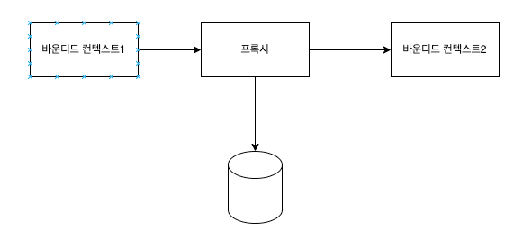
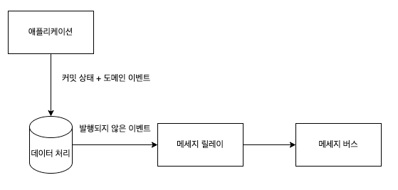

## 모델 변환

커뮤니케이션 하기 위한 다양한 설계 패턴이 있다.

### 스테이트리스 모델 변환

프록시가 동기식 통신인지 비동기식 통신인지에 따라 다르다.

**동기**

- 코드베이스에 변환 로직을 포함하는 것
- 오픈 호스트 - 유입되는 요청을 처리할 때 발생
- 충돌 방지 계층 - 업스트림 바운디드 컨텍스트를 호출할 때 발생
- API 게이트웨이 패턴과 같은 외부 컴포넌트로 넘기는 것이 효과적일 수도 있다.

**비동기**

- 메세지 프록시를 구현할 수 있다.(메세지 구독하는 중개 컴포넌트)
- 메세지 모델을 변환하는 것 외에도 메세지를 필터링하여 노이즈를 줄일 수 있음
- 오픈 호스트 서비스를 구현할 때 비동기식 모델 변환은 반드시 필요
    - 비동기 변환을 사용하면 도메인 이벤트를 가로채서 공표된 언어로 변환할 수 있음 ⇒ 캡슐화 잘됨

### 스테이트풀 모델 변환

- 원천 데이터를 집계하거나 여러 개의 요청에서 들어오는 데이터를 단일 모델로 통합해야하는 변환 매커니즘

**일괄처리**

- 들어오는 데이터를 추적하고 처리하기위해선 영구 저장소가 필요하다.
    - 스트림처리 플랫폼(kafka, aws kinesis), 일괄 처리 솔루션(spark 등)

**여러 요청 통합**

- 여러 요청에서 집계된 데이터 처리(프론트에서 많은 요청이 올때)
- 충돌 방지 계층을 전면에 배치하여 로직의 복잡성을 분리하는것이 좋을 수 있다.

### 에그리게이트 연동

- 시스템 나머지 부분과 통신하는 방법 - 도메인 이벤트 발행

**예시**

1. 애그리게이트의 도메인 이벤트 추가 후 발행

문제점

- db커밋 전에 이벤트가 전달됨
- 즉 구독자는 캠페인이 비활성화되었다는 알림을 받았지만 실제 캠페인 상태와 모순된다.
- 어떤한 일이 벌어져서 트랜잭션이 커밋되지 않는다면?
1. 애그리게이트 관련 인스턴스 로드 → 비활성화 → db 커밋 → 도메인 이벤트 발행

문제점

- 어떠한 이유로 도메인 이벤트를 발행하지 못할 수도 있다.

### 아웃박스

- 두개의 테이블에 원자적으로 커밋하고 메세지를 저장하기 위한 전용 테이블을 사용하는 것이 좋다.

- db 커밋은 따로, 메세지 릴레이에서 아웃박스 테이블을 보고 발행해라? 이뜻인가?

- 메세지 릴레이는 pull(폴링), push(트랜잭션 로그 추적) 기반으로 이벤트 가져옴
- 아웃박스 패턴은 적어도 한번은 메세지 배달을 보장한다

### 사가

- 각 트랜잭션을 애그리게이트의 단일 인스턴스로 제한한다.
- 그러나 여러 애그리게이트에 걸쳐 있는 프로세스를 구현해야할 수도 있다.
    1. 광고 캠페인 활성화 → 퍼블리셔에 제출 → 발행상태 변경(발행, 거부)

- 여러 트랜잭션에 걸쳐있는 비즈니스 프로세스
- 실행단계중 실패하면 시스템 상태를 일관되게 유지하도록 조치
- 메세징 인프라에 의존하여 관련 이벤트를 전달하고 관련 커멘드를 실행하여 이벤트에 반응
    - 상태 관리가 필요없다.
    1. 실행된 작업을 추적하여 실패시 보상조치 ⇒ 상태 관리가 필요하다.
- 컴포넌트의 상태는 궁극적으로 일관성을 갖는다.
- 사가는 이벤트를 해당 커맨드와 일치시킨다.

### 프로세스 관리자

- 비즈니스 로직 기반 프로세스를 구현하기 위한 것이다.
- 여러 단계로 구성된 응집된 비즈니스 프로세스이다.

- 경로, 예약 등 다 완료되고 프로세스 관리자가 상태를 변경(?? 이해한게 맞나??)

### 결론

- 시스템 컴포넌트를 연동하기 위한 다양한 패턴을 배웠다.

### 연습문제

1. D
2. B
3. a
4. E