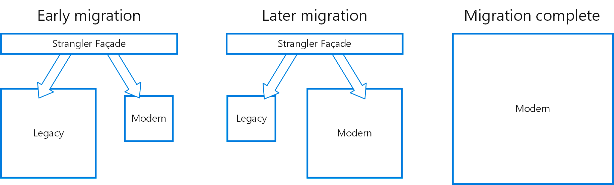

### 13 실무에서의 도메인 주도 설계

이번 장에서는 브라운필드 프로젝트와 이상적이지 않은 환경에서 실제로 도메인 주도 설계 도구와 패턴을 적용하기 위한 전략을 배운다

1. 전략적 분석
    1. 비즈니스 도메인 이해하기

       조직의 비즈니스 도메인은 무엇인가?
       고객은 누구인가?
       조직이 고객에게 제공하는 서비스 또는 가치는 무엇인가?
       경쟁 회사 또는 그들의 제품은 무엇인가?

       이 질문에 답하면 회사의 전반적인 목표에 대한 조감도를 얻을 수 있다

        1. 핵심 하위 도매인
            - 회사의 핵심 하위 도메인을 식별하려면 경쟁업체와 차별화되는 점을 찾아라
            - 경쟁업체에 없는 회사의 ‘비법 소스’는 무엇인가? 예를 들면, 특허와 같은 지적 재산과 자체 설계한 알고리즘이 있는가?
            - 경쟁 우위인 핵심 하위 도메인이 반드시 기술적인 것은 아니라는 점을 명심해라 회사가 비기술적 경쟁 우위를 가지고 있는가? 예를 들어, 최고 수준의 직원을 고용하거나 독특한 예술적 디자인을 할 수 있는 능력이 있는가?
        2. 일반 하위 도메인
            - 상용 솔루션이나 구독 서비스, 또는 연동할 수 있는 오픈소스 소프트웨어를 찾아라
        3. 지원 하위 도메인
            - 상용 솔루션으로 대체할 수 없지만 직접 경쟁 우위를 제공하지 않는 나머지 소프트웨어 컴포넌트를 찾아라
    2. 현재 설계 탐색

       컴포넌트의 특성 중 수명주기를 분리할 수 있는지 찾아라 어느 것이 다른 컴포넌트와 독립적으로 개선되고 테스트되고 배포될 수 있는지 확인하라

        1. 전술적 설계 평가
            - 각 상위 수준 컴포넌트에 대해 그것이 어느 비즈니스 하위 도메인을 포함하고 어떤 기술적 설계 의사결정을 내렸는지 확인하라
        2. 전략적 설계 평가
            - 상위 수준 컴포넌트에 대한 지식을 사용하여 이러한 컴포넌트가 바운디드 컨텍스트인 것처럼 현재 설계의 컨텍스트 맵을 차트로 표시하라
            - 바운디드 컨텍스트 연동 패턴 관점에서 컴포넌트 간의 관계를 식별하고 추적하라
            - 결과 컨텍스트 맵을 분석하고 도메인 주도 설꼐 관점에서 아키텍처를 평가하라
2. 현대화 전략
    1. 전략적 현대화
        - 컨텍스트 통합 패턴이 해결할 수 있는 문제에 주목하라
            1. 사용자-제공자 관계
            2. 충돌 방지 계층
            3. 오픈 호스트 서비스
            4. 분리형 노선
    2. 전술적 현대화
        - 무엇보다도 먼저 전술적 관점에서 비즈니스 가치와 구현 전략에서 가장 ‘고콩스러운’ 부조화를 찾아내야 한다
    3. 유비쿼터스 언어 육성
        - 성공적인 현대화 설계의 전제조건은 비즈니스 도메인 지식과 비즈니스 도메인의 효과적인 모델을 만드는 것
        - (이벤트스토밍을 통해 유비쿼터스를 다루어라…?)
        1. 스트랭글러 패턴
            - 스트랭글러 무화과(Strangler fig) : [https://en.wikipedia.org/wiki/Strangler_fig](https://en.wikipedia.org/wiki/Strangler_fig)
            - 새로운 바운디드 컨텍스트인 스트랭글러를 생성하고, 이 스트랭글러를 사용하여 새로운 요구사항을 구현하고 점차적으로 레거시 컨텍스트의 기능을 해당 컨텍스트로 마이그레이션한다
            - 기능은 새로운 바운디드 컨텍스트인 스트랭글러로 마이그레이션되고, 숙주가 죽는 것과 유사하게 레거시 코드베이스가 제거된다
            - 일반적으로 스트랭글러 패턴은 파사드 패턴(facade pattern)과 함께 사용한다

           

        2. 전술적 설계 의사결정 리팩터링
            1. 작은 점진적인 조치가 대규모 재작성보다 안전하다
            2. 작은 점진적인 조치를 수행하는 것과 동일한 이유로, 도메인 모델로의 리팩터링이 한 번에 이루어질 필요는 없다
            3. 레거시 시스템을 리팩터링하는 것처럼 필요시 충돌 방지 계층을 사용하여 이전 모델로부터 새 코드베이스를 보호할 수 있으며, 오픈 호스트 서비스를 구현하고 공표된 언어를 노출하여 레거시 코드베이스의 변경으로부터 사용자를 보호
3. 실용적인 도메인 주도 설계
    - 비즈니스 도메인과 해당 전략을 분석하고, 특정 문제를 해결하기 위한 효과적인 모델을 찾고, 무엇보다도 비즈니스 도메인의 요구사항에 따라 설계 의사결정을 내린다면 그것이 바로 도메인 주도 설계다!
    - (트레이드 오프… 해라!)
4. 도메인 주도 설계 확산
    1. 실무에 활용하는 도메인 주도 설계
        1. 유비 쿼터스 언어
            - 유비쿼터스 언어의 사용은 도메인 주도 설계의 초석이다 도메인 지식 발견과 커뮤니케이션, 효과적인 솔루션 모델링에 반드시 필요하다
            - 일치하지 않은 용어를 찾고 설명을 요청해라
            - 가능한 한 도메인 전문가와 소통하라
        2. 바운디드 컨텍스트
            - 가능한 분해 방법을 탐색할 때 바운디드 컨텍스트 패턴의 기반이 되는 원칙을 확인
            - 바운디드 컨텍스트 통합 패턴에 대해 동일한 추론을 사용하라 각 패턴이 해결해야 하는 문제를 이해하고 있는지 확인하라
        3. 전술적 설계 의사결정
            - 전술적 설계 패턴에 대해 논의 할 때 권위자에게 호소하지 마라 대신 논리에 호소하라
            - 예)
                - 명시적 트랜잭션 경계가 중요한 이유는 무엇일까? 데이터의 일관성을 보호하기 위해서다
                - 이벤트 소싱 대신에 이벤트를 로그 파일에 기록할 수 없는 이유는 무엇일까? 장기적으로 데이터 일관성이 보장되지 않기 때문이다
        4. 이벤트 소싱 도메인 모델
            - 상태 기반 모델과 이벤트 기반 모델을 보여주라
            - 특히 시간 차원과 관련하여 이벤트 소싱이 제공하는 차이점과 이점을 설명하라
            - 종종 그들은 그것이 제공하는 통찰력에 열광하고 스스로 이벤트 소싱을 옹호할 것이다
5. 결론
    1. 그린필드 프로젝트와 마찬가지로 항상 비즈니스 도메인 분석부터 시작하라
    2. DDD가 조직에서 널리 채택되지 않은 경우에도 도메인 주도 설계 도구를 사용할 수 있다

**연습 문제**

1. B or C
2. B
3. C
4. 넓은 트랜잭션 범위는 애그리게이트의 복잡성을 증가시키고 성능에 부정적인 영향을 준다
