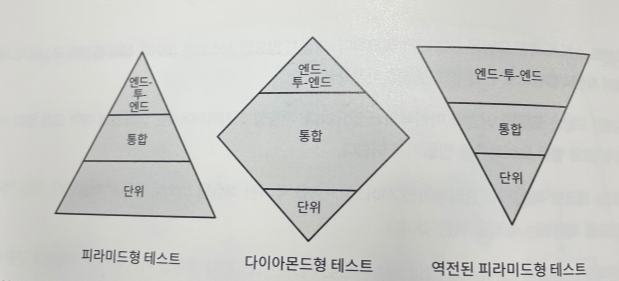

### 휴리스틱

> 모든 상황에 맞게 보장되고 수학적으로 검증된 규칙이 아니라 경험에 기반한 규칙이다.
>

### 바운디드 컨텍스트

바운디드 컨텍스트의 최적의 크기는 무엇일까?

- 바운디드 컨텍스트의 경계를 설계할 때 이런 특성을 휴리스틱으로 사용할 수 있다.
    - 넓은 바운디드 컨텍스트의 경계 또는 하위 도메인에 걸친 경계는 그 경계 또는 하위 도메인을 포함하는 모델이 잘못돼도 안전하게 해준다.
    - 적은 비용이 든다
    - 즉 설계할 때는 경계를 넓게 해서 시작해야한다.

### 비즈니스 로직 구현 패턴

비즈니스 로직의 구현 패턴을 선택하기 위한 효과적인 휴리스틱은 다음과 같다.

- 어떠한 동작에 대한 심층적인 분석을 요청하였는가? → 이벤트 소싱 모델 적용
- 하위 도메인의 비즈니스 로직이 복잡한가? → 도메인 모델
- 복잡한 자료구조를 포함하는가? → 액티브 레코드 패턴
- 아니라면 ⇒ 트랜잭션 스크립트

⇒ 이러한 상황은 하위 도메인과 비즈니스 도메인에 대한 추측을 되돌아본다.

### 아키텍처 패턴(계층형, 포트와 어댑터, CQRS)

- 유일한 예외는 CQRS

### 테스트 전략

**피라미드형 테스트**

- 단위테스트 강조
- 애그리게이트와 밸류 오브젝트 도메인 모델 패턴을 모두 잘 지원

다이아몬드형 테스트

- 통합테스트에 집중
- 서비스, 비즈니스 로직 계층에 연동에 중점을 둔다면 효과적

역전된 피라미드

- 엔드 투 엔드에 집중
- 애플리케이션 워크플로우에 집중

### 전술적 설계 의사결정 트리

- 도메인의 유형을 식별하고 트리를 참조하는 것은 필수적인 설계 결정 시작점
- 하지만 상황에 따라 효과적인 접근 방법은 달라짐
- 그러므로 당면한 문제에 더 잘 맞는 다른 것을 찾고 개선해가자 (자신만의 것을 찾자…)

### 결론

- 당면한 문제에 더 잘 맞는 다른 것을 찾고 개선