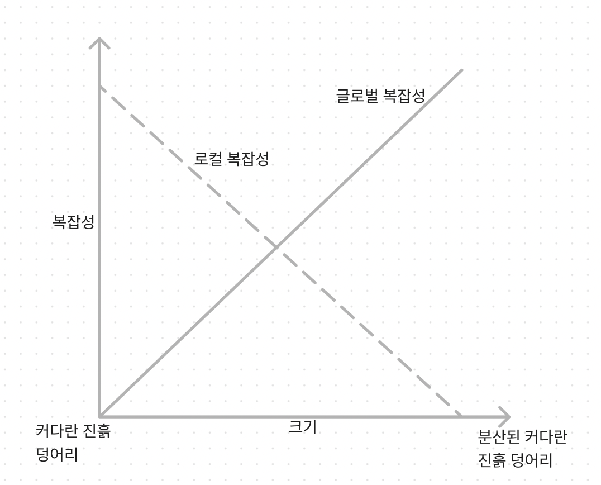
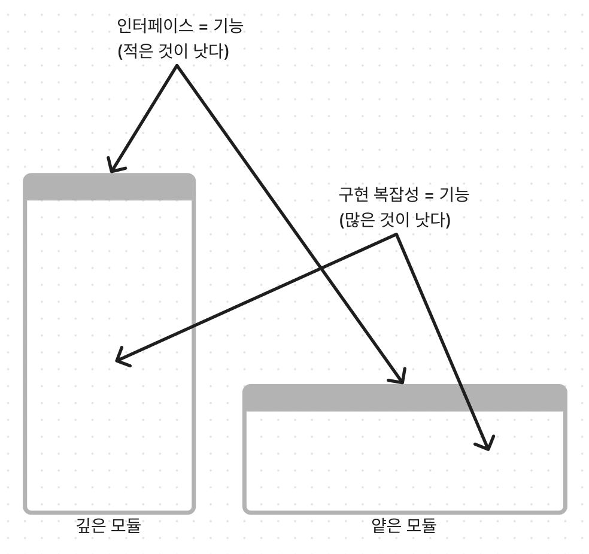

### 14 마이크로서비스

1. 서비스란 무엇인가?
    - 서비스는 미리 정의된 인터페이스를 사용해 하나 이상의 역량에 접근하기 위한 메커니즘이다
    - 미리 정의된 인터페이스는 서비스로부터 데이터를 넣고 빼는 모든 메커니즘을 말한다
2. 마이크로서비스란 무엇인가?
    - 마이크로서비스는 자신의 마이크로 퍼블릭 인터페이스, 즉 마이크로 프런트 도어(micro-front door)에 의해 정의되는 서비스이다
    1. 설계 목표 (이건 진짜 뭐라는지 모르겠습니다 해석불가임)
    2. 시스템의 복잡성
        - 로컬 복잡성
            - 각각의 개별 마이크로서비스의 복잡성
            - 서비스의 구현에 따라 달라진다
        - 글로벌 복잡성
            - 전체 시스템의 복잡성
            - 서비스 간의 상호작용과 의존성으로 정의

       

    3. 깊은 서비스로서의 마이크로서비스
        - 모듈화의 개념에 대해 논의하고 모듈의 설계를 평가하기 위한 간단하지만 강력한 시각적 휴리스틱인 ‘깊이(depth)’를 제시

       

    4. 싶은 모듈로서의 마이크로서비스
        - 시스템의 복잡성 관점
            - 깊은 모듈은 시스템의 글로벌 복잡성을 줄여준다
            - 얕은 모듈은 로컬 복잡성을 감싸지 않는 구성요소를 도입해야 해서 글로벌 복잡성이 증가

       

       (훨씬 더 깊은 곡선인데 그림을 못그림)

3. 도메인 주도 설계와 마이크로서비스의 경계
    1. 바운디드 컨텍스트
        - 마이크로서비스와 바운디드 컨텍스트 모두 물리적 경계다
        - 바운디드 컨텍스트와 마찬가지로 마이크로서비스도 단일 팀이 소유한다
        - 바운디드 컨텍스트와 동일하게, 충돌하는 모델은 인터페이스가 복잡해지므로 마이크로서비스로 구현할 수 없다
        - 마이크로서비스는 사실상 바운디드 컨텍스트다
    2. 애그리게이트
        - 애그리게이트와 자신의 하위 도메인에 있는 다른 비즈니스 엔티티와의 관계가 강할수록 얕은 개별 서비스가 된다
        - 애그리게이트를 서비스화해 모듈형 설계를 만들어내는 경우도 있다 하지만 이 같은 작은 크기의 서비스는 전체 시스템의 글로벌 복잡성을 증가시킨다
    3. 하위 도메인
        - 마이크로서비스를 설계하는 데 좀 더 균형 잡힌 휴리스틱은 비즈니스 하위 도메인의 경계와 서비스를 일치시키는 것이다
        - 같은 비즈니스 도메인 모델을 사용하고, 같거나 밀접하게 관련된 데이터를 다루며, 강한 기능 연관성을 갖는다
4. 마이크로서비스의 퍼블릭 인터페이스 압축하기
    1. 오픈 호스트 서비스
        - 연동 지향 모델은 공표된 언어를 도입하면 시스템의 글로벌 복잡성이 줄어든다
        1. 서비스 사용자에게  영향을 미치지 않고 서비스의 구현을 발전시킬 수 있다
        2. 공표된 언어는 좀 더 제한된 모델을 노출한다
    2. 충돌 방지 계층
        - 충돌 방지 계층(ACL) 패턴은 다른 방식으로도 작동한다
        - 서비스를 다른 바운디드 컨텍스트와 연동할 때 복잡성을 줄여준다
        - 이 개념은 한 걸음 더 나아가 독립적인 서비스로도 구현할 수 있다

**연습문제**

1. A
2. D
3. C
4. D
