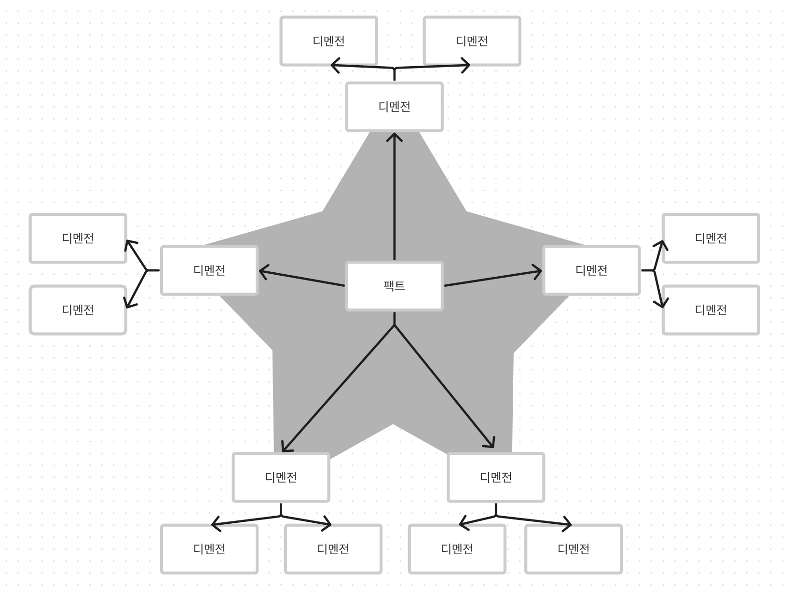
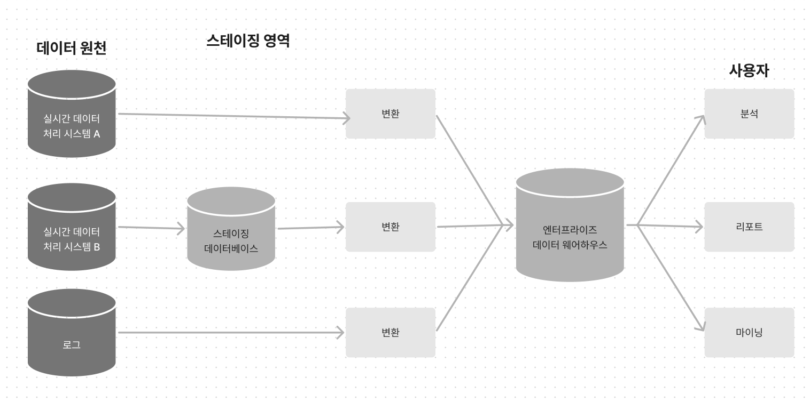

### 16 데이터 메시

분석 데이터 관리 아키텍처(analytical data management architecture), 일명 데이터 메시(data mesh)

### 분석 데이터 모델과 트랜잭션 데이터 모델의 비교

- 모델(엔티티)은 실시간 데이터 처리 시스템을 위한 것이므로 실시간 비즈니스 트랜잭션을 지원하도록 최적화돼야 한다
- 분석 모델은 실시간 데이터 처리 시스템에 대한 다양한 통찰을 제공하도록 고안됐다

1. 팩트 테이블
    1. 팩트(fact)는 이미 발생한 비즈니스 활동을 나타낸다
    2. 팩트는 과거에 일어난 것에 대해 설명한다는 점에서 도메인 이벤트의 개념과 비슷하다
    3. 팩트는 비즈니스 프로세스의 활동을 나타낸다
    4. 도메인 이벤트와 비슷하게 팩트 레코드는 절대로 삭제되거나 수정되지 않는다
    5. 분석 데이터는 추가만 가능한 데이터다
    6. OLAP와 OLTP 모델의 또 다른 큰 차이점은 데이터의 세분화 정도(aranularity)다
2. 디멘전 테이블
    1. 팩트가 비즈니스 절차 또는 동작을 표현한다면(동사), 디멘전은 팩트를 묘사한다(형용사)
    2. 디멘전은 팩트의 속성을 설명하도록 고안되어 팩트 테이블에 있는 외부 키로 디멘전 테이블을 참조한다
    3. 디멘전이 고도로 정규화된 이유는 분석 시스템에서 유연한 질의를 지원해야 하기 때문이다 / 이것이 바로 실시간 데이터 모델과 분석 모델의 또 다른 차이점이다
    4. 어떤 질의가 실행될지 예측하기 어렵다
    5. 정규화를 통해서 동적인 질의 및 필터링을 지원하고 다양한 디멘전에 걸친 팩트 데이터에 대한 그룹화를 지원한다
3. 분석 모델

   

    - 디멘전이 다른 디멘전을 가리키는 것을 제외한 것을 표현한 테이블 구조를 스타 스키마(star schema)라고 부른다
    - 팩트와 디멘전의 고나계가 다대일(many-to-one)인 경우다
    - 위 그림은 스노플레이크 스키마(snowflake schema)다
    - 각 디멘전은 더 작은 세밀한 디멘전으로 정규화 된다

### 분석 데이터 관리 플랫폼

1. 데이터 웨어하우스
    1. 데이터 웨어하우스(DWH: data warehouse)
    2. 기업의 모든 실시간 데이터 처리 시스템에서 데이터를 추출해서 분석 모델로 변환한 후에 분석 지향 데이터베이스(analysis-oriented databse)에 적재한다 → 이 데이터베이스가 데이터 웨어하우스이다
    3. 데이터 관리 아키텍처는 기본적으로 ETL(extract-transform-load) 스크립트를 기반으로 한다

   

2. 데이터 레이크
    1. 데이터 레이크 아키텍처는 실시간 데이터 처리 시스템의 데이터를 유입하고 분석 보델로 변환하는 동일한 개념에 기반한다
    2. 1-c 그림에서 스테이징 데이터베이스가 데이터 레이크이다
    3. 실시간 데이터 처리 시스템의 데이터는 원본 형태로 저장되고 나중에 변환되므로 데이터 레이크에서는 여러 가지 작업 지향 분석 모델을 작동시키는 것이 가능하다
    4. 데이터 레이크는 유입되는 데이터에 스키마를 강제하지 않은 무(없을 무)스키마이며, 수신 데이터의 품질을 제어하지 않는다
    5. “데이터 레이크가 데이터의 늪이 된다”
3. 데이터 웨어하우스와 데이터 레이크 아키텍처의 도전과제
    1. 구현 모델에 대한 결합도는 실시간 데이터 처리 시스템 및 분석 시스템 팀 간에 마찰을 야기한다
    2. 데이터 분석가와 데이터 엔지니어는 다른 조직에 소속되므로 실시간 데이터 처리 시스템의 개발 팀이 소유한 비즈니스 도메인에 대한 깊이 있는 지식이 부족하다
    3. 구현 모델의 결합은 비즈니스 도메인의 모델을 지속해서 개선하고 발전하는 것을 강조하는 도메인 주도 설계 기반의 프로젝트에서 특히 심하다

### 데이터 메시

어떤 의미에서 데이터 메시 아크텍처는 분석 데이터를 위한 도메인 주도 설계라고 볼 수 있다

1. 도메인 기준의 데이터 분리
    1. 데이터 메시 아키텍처는 모놀리식 분석 모델을 구축하는 대신, 3장에서 논의한 실시간 데이터를 위한 솔루션, 즉 원천 데이터에 분석 모델을 일치시켜서 데이터를 사용하므로 여러 분석 모델을 사용할 수 있다 (마케팅, 지원, 판매 등등)
2. 제품 관점에서 데이터 다루기
    1. 고전적인 데이터 관리 아키텍처는 양질의 분석 데이터를 찾고 이해하고 가져오기 어렵다
    2. 분석 데이터는 통상적인 퍼블릭 API와 동일하게 취급돼야 한다
    3. 분석 데이터는 제품 관점에서 제공되므로 사용자의 요구를 반영해야한다
    4. 사용자마다 여러 형태의 분석 데이터가 필요할 수도 있다 / 데이터 제품은 다양한 사용자의 요구사항을 충족하는 여러 형태의 데이터를 제공하도록 다양한 언어를 제공해야한다
3. 자율성 활성화
    1. 전담 데이터 인프라스트럭처 플랫폼 팀이 필요하다 → 팀의 구성을 얘기하는 듯. 세분화 시킨 팀이 필요하고 전문가가 필요하다.
4. 데이터 메시와 도메인 주도 설계를 엮기
    1. 유비쿼터스 언어와 결과 도메인 지식은 분석 모델 설계를 위한 필수 요소다
    2. 자신의 실시간 데이터 모델과 다른 모델로 바운디드 컨텍스트 데이터를 노출하는 것은 오픈 호스트 패턴이다
    3. 데이터 메시 아키텍처는 분석 유스케이스를 구현하기 위해 다양한 바운디드 컨텍스트의 모델을 묶기 때문에 실시간 데이터 모델을 위한 바운디드 컨텍스트의 연동 패턴은 분석 모델에도 적용된다
