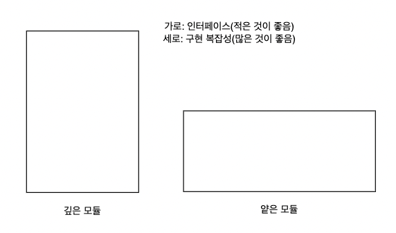
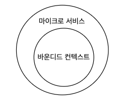

<aside>
💡 도메인 주도 설계 방법론과 마이크로서비스 아키텍처 패턴의 관계를 탐구
두 패턴간의 상호작용, 효과적으로 설계하는 방법

</aside>

### 서비스란?

미리 정의된 인터페이스를 사용해 하나 이상의 역량에 접근하기 위한 메커니즘

- 요청/응답 모델과 같은 동기식 모델, 이벤트를 제공하는 비동기식 모델

### 마이크로 서비스란?

자신의 마이크로 퍼블릭 인터페이스(마이크로 프런트 도어)에 의해 정의되는 서비스

- 마이크로 퍼블릭 인터페이스가 있으면 서비스가 연동하는 다른 시스템 구성요소 모두를 쉽게 이해할 수 있고 기능을 줄이면 변경될 이유가 줄어들고 개발, 관리, 확장이 자유로움
- 자신의 데이터베이스를 노출하지 않는다.

### 서비스형 메서드: 완벽한 마이크로서비스?

서비스 하나에 메서드 하나 라는 규칙을 적용한다고 해보자.

어떤 서비스도 다른 서비스의 데이터베이스에 직접 접근할 수 없고 퍼블릭 인터페이스를 통해서만 가능하다.

그렇기 때문에 연동 관련 관심사를 처리하기 위해 서비스의 인터페이스를 확장해야한다.

⇒ 외부 노출 시스템 영역은 최소화되지만 전체적인 시스템 기능을 구현하기 위해 각 서비스에 스테프만 출입 가능한 수많은 출입구를 추가해야한다.(A B C가 있다면 A에 B,C의 출입구를 만들어야한다. 만약 많아진다면 엄청 많아짐)

### 설계 목표

서비스형 메서드에서 나온것 처럼 단일 메서드만 갖도록 분해하는 것은 불가능하다.
⇒ 서로 협력해야하므로 연동에 관련된 퍼블릭 메서드를 가진 퍼블릭 인터페이스를 만들어야했다.
⇒ 각 서비스는 간단해졌지만 전체로 보면 엄청 복잡해졌다.
이것이 마이크로 서비스가 아닌가? 넷플릭스나 다른 서비스들도 서로 연관이 엄청 있어서 복잡한듯?

### 시스템의 복잡성

로컬 복잡성: 마이크로서비스의 복잡성
글로벌 복잡성: 전체 시스템의 복잡성 ⇒ 서비스간의 상호작용과 의존성으로 정의

글로벌 복잡성을 줄이는 것은 간단 ⇒ 시스템 구성요소간의 상호작용을 없애기만 하면 됨 ⇒ 모놀리식 서비스

적절한 마이크로서비스 시스템은 로컬 복잡성과 글로벌 복잡성이 최적화가 되어야한다.

### 깊은 서비스로서 마이크로서비스

- 효과적인 모듈은 깊이가 깊다.(구현하는 것은 복잡하긴 하지만 전체 메서드 개수는 적음)
- 얕은 모듈은 비효율적 (함수가 간단한데 엄청 많이 구현해야함) ⇒ 수많은 유동적인 부분을 만들어내고 복잡성을 내포하는 대신 전체 시스템에 우발적 복잡성을 발생시킴

### 도메인 주도 설계와 마이크로서비스의 경계

바운디드 컨텍스트는 모델의 경계다.

1. 바운디드 컨텍스트
    1. 마이크로 서비스와 바운디드 컨텍스트는 공통점이 많음, 하지만 혼동하지 말자
    2. 둘다 단일팀에서 소유 , 충돌하는 모델은 마이크로서비스로 구현 X ⇒ 마이크로서비스는 바운디드 컨텍스트
    3. 바운디드 컨텍스트는 여러 하위 도메인을 포함하게 되어 자연스럽게 폭넚은 바운디드 컨텍스트가 생긴다. ⇒ 하위 도메인은 다른것으로 옮길 수 있다. 그리고 여러 형태로 분해가 가능하다. ⇒ 그렇기 때문에 바운디드 컨텍스트는 반드시 마이크로 서비스라고 할 수는 없다.

1. 애그리게이트
    1. 바운디드 컨텍스트는 넓게 설정
    2. 애그리게이트는 좁게 설정
    3. 애그리게이트는 내부 비즈니스 규칙과 불변성, 로직의 복잡성을 감싸는 개별적인 비즈니스 기능단위
       ⇒ 애그리게이트와 자신의 하위 도메인에 있는 다른 비즈니스 엔티티와의 관계가 강할수록 얕은 개별 서비스가 된다.
2. 하위 도메인
    1. 비즈니스 하위 도메인의 경계와 서비스를 일치시키는 것이다.
    2. 같은 비즈니스 도메인 모델을 사용하고, 같거나 밀접하게 관련된 데이터를 다루며, 강한 기능 연관성을 갖는다.
    3. 하위 도메인의 ‘크기’와 ‘어떻게’보다는 ‘무엇에’ 중점을 둔 기능이 하위 도메인을 자연스럽게 깊은 모듈로 만든다. ⇒ 인터페이스는 적고 기능 구현은 많은
    4. 하위 도메인을 마이크로 서비스로 만드는 것은 좋은 방법일 수도 있다.(약간 날방에 엔트미디어를 바로 붙이는 것보다는 하나의 서비스를 따로 빼서(송출 서버) 만드는 것이 좋은 방법일 수도 있다?)

### 마이크로서비스의 퍼블릭 인터페이스 압축하기

서비스의 경계를 찾는 데 쓰일 뿐만 아니라, 서비스를 깊게 만드는 데도 도움을 준다.

1. 오픈 호스트 서비스
    1. 비즈니스 도메인의 바운디드 컨텍스트 모델을 시스템의 다른 구성요소와 연동하는 데 사용되는 모델과 분리 ⇒ 사용자에게 영향을 미치지 않고 서비스의 구현을 발전 시킬 수 있음
2. 충돌 방지 계층
    1. 서비스를 다른 바운디드 컨텍스트와 연동할 때 복잡성을 줄여준다. ⇒ 독립적인 서비스로도 구현 가능

### 결론

마이크로 서비스와 DDD는 연관이 깊다.

마이크로서비스는 바운디드 컨텍스트다. 하지만 바운디드 컨텍스트는 마이크로서비스이다.

그리고 모듈의 깊이 조절을 잘 해야한다.

### 연습문제

1. A
2. D
3. C
4. D