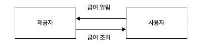
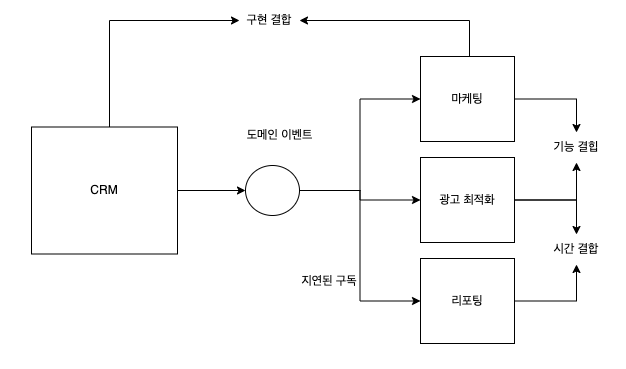
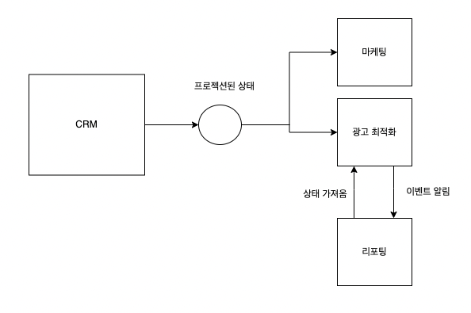

<aside>
💡 EDA(event-driven architecture)
느슨하게 결합되고 확장 가능
이벤트를 기반으로 하고 이벤트는 DDD
⇒ EDA와 DDD사이의 상호작용 탐구

</aside>

### EDA

- 이벤트 메세지를 교환하면서 비동기적으로 서로 커뮤니케이션하는 아키텍처 스타일이다.
- 컴포넌트가 이벤트를 발행해서 시스템 도메인의 변경사항을 다른 시스템 요소에 알려준다. ⇒ 이벤트를 구독하고 그에 따라 반응한다.
- EDA는 서비스간의 통신

### 이벤트란?

**이벤트 교환**

- 구성요소를 연동해서 시스템으로 만들기 위한 핵심 통신 메커니즘

이벤트

- 이미 발생한 변화를 설명하는 메세지 ⇒ 이미 일어난 일

커맨드

- 수행돼야 할 작업을 설명하는 메세지 ⇒ 지시

이벤트 알림

- 다른 컴포넌트가 반응할 비즈니스 도메인의 변경에 관한 메세지
- 이벤트를 알리는 것이 목적 ⇒ 모든 정보를 포함해서는 안된다.
    - 이벤트를 알리고 상세정보를 조회하게 한다.

  

    - 재난 문자
- 보안
    - 구독자가 데이터에 접근하기 위해 추가 권한이 필요하다.
- 동시성
    - 정보가 구독자에게 도착했을 때 이미 만료된 상태로 렌더링 될 수 있다.

이벤트를 통한 상태 전송

- 이벤트를 통한 상태 전송 (ECST - event-carried state transfer)
    - 내부 상태의 변경사항을 알려준다.

도메인 이벤트

- 이벤트 알림과 ECST 중간 느낌
- 비즈니스 도메인에서 중요한 이벤트를 설명하고 관련된 모든 데이터를 포함한다.

도메인 이벤트와 이벤트 알림의 관계

- 도메인 이벤트에는 이벤트를 설명하는 모든 정보를 포함한다.
- 모델링 의도가 다름
    - 이벤트 알림 - 다른 컴포넌트와의 연동을 돕기 위해서
    - 도메인 이벤트 - 비즈니스 도메인을 모델링하고 설명하기 위한것

도메인 이벤트와 이벤트를 통한 상태 전송의 관계

- ECST는 로컬 캐시로 보유하기에 충분한 정보를 제공한다.
- 도메인 이벤트는 풍부한 모델을 노출해서는 안된다.

### 정리하자면

이벤트 알람 - 어떠한 이벤트 발생 외에는 정보가 없음

상태 전송 메세지 - 상태가 변경된 것 외에는 정보가 없음

도메인 이벤트 - 도메인의 이벤트 특성과 비슷

### 이벤트 주도 연동 설계

<aside>
💡 다양한 이벤트 유형을 적용하기 위한 휴리스틱 학습 
어떻게 하면 이벤트를 사용하면 강한 결합을 가진 분산된 커다란 진흙 덩이르를 설계할 수 있는지 알아보자

</aside>

분산된 커다란 진흙 덩어리

**위의 정리**

CRM 바운디드 컨텍스트 - 이벤트 소싱 도메인 모델 적용

광고 최적화 컨텍스트 - CRM에서 생성된 도메인 이벤트를 구독하고 광고최적화의 요구사항에 맞는 모델 프로젝션

리포팅 바운디드 컨텍스트 - CRM에서 발행한 도메인 이벤트의 일부만 구독, 이벤트 알림 베세지 사용

**시간 결합**

광고최적화, 리포팅은 시간적으로 경합하여 엄격한 실행순서에 따라 달라짐 - 순서가 역전되면 리포팅 시스템에서 일관성 없는 데이터가 생성

- 필요한 실행 순서를 위해 리포팅 시스템에 처리 프로세스를 지연했을 경우 명백하게 잘못된 순서로 실행되는 것을 막지 못한다.
    - 과부하
    - 네트워크 문제
    - 컴포넌트 중단

**기능 결합**

CRM의 도메인 이벤트를 구독하고 결국 동일하게 고객 데이터를 포로젝션하도록 구현되어 있다.

- 비즈니스 로직을 양쪽에 복제하고 변경되면 양쪽 변경 ⇒ 컴포넌트가 많아질수록 불편

**구현 결합**

CRM 구현의 변경사항이 발생하면 이것을 구독하는 양쪽 바운디드 컨텍스트 모두 반영

**이벤트 주도 연동 리팩토링**

- 마케팅, 광고최적화 구독자는 같은 비즈니스 기능을 구현하여 기능적으로 결합
- 프로젝션 로직을 캡슐화하여 결합도를 낮출 수 있다.
- 광고최적화와 리포팅은 시간 결합을 처리하기 위해 이벤트 발행하고 가져오는 방법

**최악의 상황 가정**

- 네트워크 느림
- 서버 장애
- 이벤트 순서대로 도착 X
- 이벤트 중복

**해결**

- 메세지를 안정적으로 발송하기 위해 아웃박스 패턴 사용
- 발송할 때 구독자가 메세지 중복을 제거하고 순서가 잘못된 메세지를 식별하고 재정렬
- 사가 패턴과 프로세스 관리자 패턴 활용

퍼블릭 이벤트, 프라이빗 이벤트 사용

- 세부 정보를 노출하지 않도록 주의
- 퍼블릭 인터페이스를 설계할 때 다른 유형의 이벤트를 활용하라
- 외부 바운디드 컨텍스트와 통신을 위한 도메인 이벤트는 최소화하여 사용한다.

### 결론

바운디드 컨텍스트 간의 통신

- 이벤트 알림
- 상태 전송
- 도메인 이벤트

EDA 시스템을 커다란 진흙 덩어리로 만들지 말고 잘 설계해보자.

### 연습문제

1. D
2. B
3. A
4. D → B