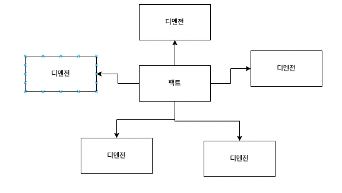
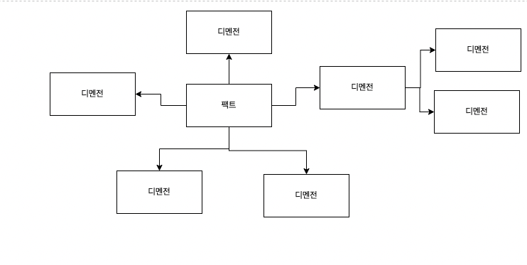
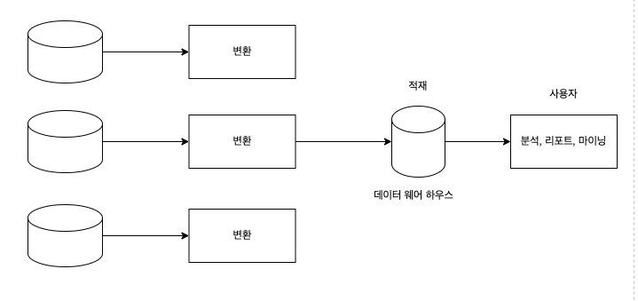
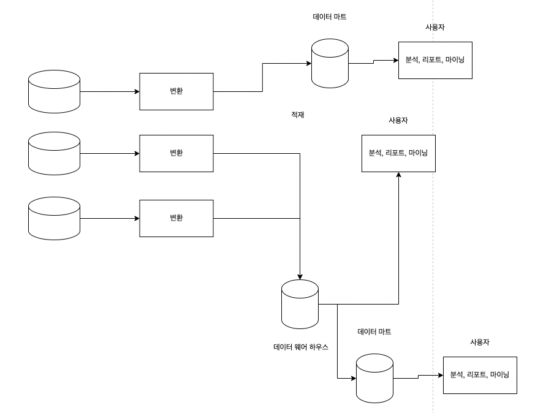
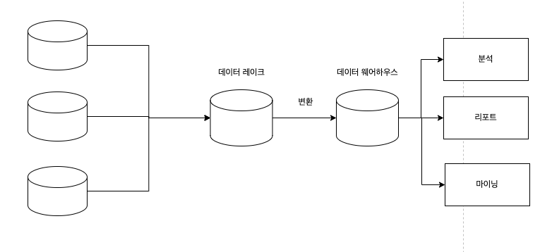
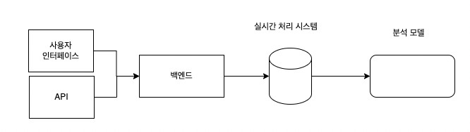

<aside>
💡 분석 데이터 관리 아키텍처, 일명 데이터 메시에 대해서 배운다. 
데이터 메시 기반 아키텍처가 어떻게 동작하고 전통적인 OLAP 데이터 관리와 접근 방식이 어떻게 다른지 알아보자.

</aside>

### 용어 정리

- OLTP(online transactional processing) - 실시간 데이터 모델
- OLAP(online analytical processing) - 분석 모델

### 분석 데이터 모델과 트랜잭션 데이터 모델의 비교

실시간 데이터 모델

- 비즈니스 도메인에 속한 다양한 엔티티를 중심으로 구축되고 이들의 수명주기를 구현하며 상호작용을 조율한다.
- 팩트 테이블과 디멘전 테이블을 모델링하여 비즈니스 활동에 집중

분석 모델

- 비즈니스 활동의 성과에 대한 통찰을 제공하는 것을 목표로 함

**팩트 테이블**

- 이미 발생한 비즈니스 활동을 나타냄
- 팩트 레코드는 삭제되거나 수정되지 않는다. ⇒ 추가만 가능
- 세분화 정도가 중요하다. ⇒ 트랜잭션을 다루기 위해 가장 정밀한 데이터가 필요하다.

**디멘전 테이블**

- 팩트를 묘사한다.
- 디멘전이 고도로 정규화된 이유는 분석 시스템에서 유연한 질의를 지원해야하기 때문이다.

**분석 모델**

- 스타 스키마

*팩트와 디멘전 - 다대일 관계

- 스노플레이크 스키마

- 더 작은 공간에 디멘전 데이터를 저장
- 테이블을 많이 조인해야해서 많은 컴퓨터 자원이 필요

### 분석 데이터 관리 플랫폼

데이터 웨어하우스

데이터 레이크

### 데이터 웨어하우스

- 기업의 모든 실시간 데이터 처리 시스템에서 데이터를 추출해서 분석 모델로 변환한 후에 분석 지향 데이터베이스에 적재한다.
- 다양한 원천 데이터 수집(로그, 이벤트, 등..)
- 변환할 때 유입되는 데이터를 저장하기 위한 임시 저장소가 필요 - 스테이징 영역

- 데이터 웨어하우스 아키텍처의 중심에는 엔터프라이즈 전반의 모델을 구축하는 목표가 있다.
    - 기업의 모든 시스템에서 생성되는 데이터를 묘사
    - 다양한 분석 데이터의 사용 사례를 다룬다.

- 모든 상황을 아우르는 모델을 구축하는 것의 어려운점은 데이터 마트를 사용하여 부분적으로 해결 가능하다.
- 데이터 마트가 실시간 데이터 처리 시스템으로부터 데이터를 직접 가져오는 전담 ETL 프로세스를 구현할 수도 있다. ⇒ 하지만 다양한 마트에서 데이터를 조회하는 것은 어려움

### 데이터 레이크

- 실시간 데이터 처리 시스템으로부터 데이터를 받는다.
- 그러나 데이터를 바로 분석 모델로 변환하는 대신 원본 형태, 즉 원래의 실시간 데이터 모델로 보관한다.
- 데이터를 이해하고 분석 모델을 생성하는 ETL 스크립트를 구현하며 이를 데이터 웨어하우스에 제공해야한다.
- 여러가지 작업 지향 분석 모델을 작동시키는 것이 가능하다.

- 분석 모델을 나중에 생성하게 되면 전체적인 시스템의 복잡성이 증가한다. ⇒ 특정 규모 이상이 되면 혼란

### 데이터 메시

- 분석 데이터를 위한 도메인 주도 설계
- 분석 데이터에 대한 모델과소유 경계를 정의하고 프로젝션한다.

**도메인 기준의 데이터 분리**

- 데이터 웨어하우스, 데이터 레이크 모두 엔터프라이즈의 모든 데이터를 하나의 큰 모델로 통합하는 것이 목표
- 데이터 메시는 모놀리식 분석 모델을 구축하는 대신 원천 데이터에 분석 모델을 일치시켜서 데이터를 사용하므로 여러 분석 모델을 사용할 수 있다.

**제품 관점에서 데이터 다루기**

- 제품 관점에서 분석 데이터를 중요하게 다뤄야한다.
- 데이터 메시 기반 시스템에서 바운디드 컨텍스트가 잘 정의된 출력 포트를 통해 분석 데이터를 제공한다.
- 사용자의 요구를 반영해야한다.
- 분석 요건을 충족할 수 있도록 작은 크기의 분석 모델이 엮일 수 있게 하는 것이다.
- 사용자마다 여러 형태의 분석 데이터가 필요할 수도 있다.

**자율성 활성화**

- 다른 바운디드 컨텍스트에서 제공하는 데이터 제품도 사용할 수 있어야한다.

**에코시스템 구축**

- 상호 운용과 에코시스템을 가능하게 할 연합 거버넌스 기구를 임명하는 것이다.

### 데이터 메시와 도메인 주도 설계를 엮기

네 가지 원칙이 있다.

- 유비쿼터스 언어와 결과 도메인 지식은 분석 모델 설계를 위한 필수 요소이다.
- 자신의 실시간 데이터 모델과 다른 모델로 바운디드 컨텍스트 데이터를 노출하는 것은 오픈 호스트 패턴이다.
- CQRS 패턴은 동일한 데이터에 대한 여러 모델을 쉽게 생성하게 해준다.
- 데이터 메시 아키텍처는 분석 유스케이스를 구현하기 위해 다양한 바운디드 컨텍스트의 모델을 묶기 때문에 실시간 데이터 모델을 위한 바운디드 컨텍스트의 연동 패턴은 분석 모델에도 적용된다.